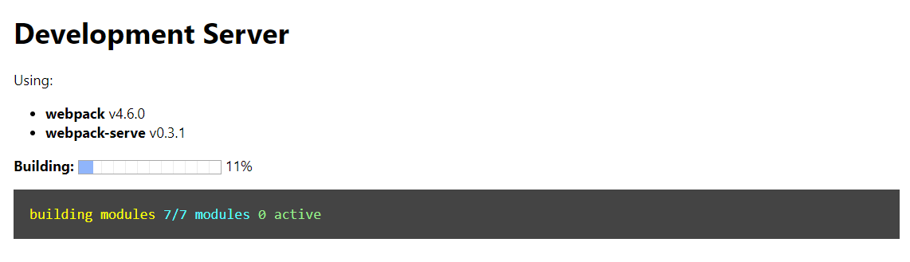
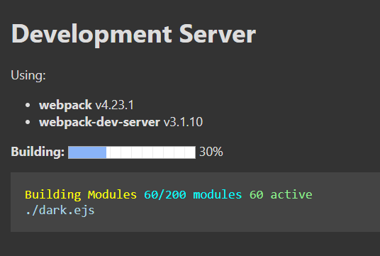
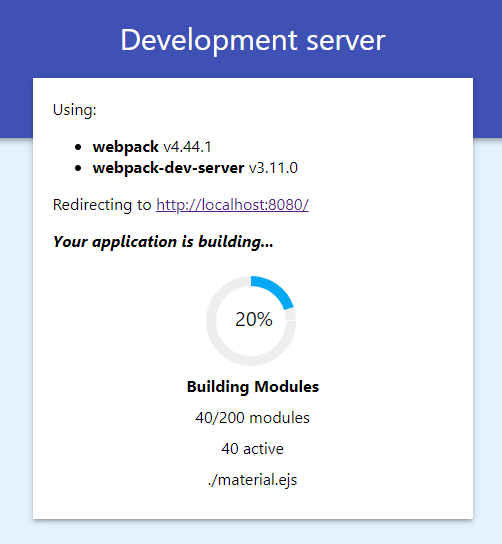

[](https://badge.fury.io/js/webpack-serve-waitpage)

# webpack-serve-waitpage
Webpack progress wait page for webpack-serve

Instead of waiting for webpack to finish compiling, see a nice progress wait page.



## Themes

There are other themes to choose from:

Dark

Material


### *** And you can also create your own! ***
See **Developing a new template** below

## Usage

#### webpack.config.js
```js
const webpackServeWaitpage = require('./libs/webpack-serve-waitpage');

...
  plugins: [

    // inside the plugins section of the config add the following
    webpackServeWaitpage.plugin,
  ],

...

module.exports.serve = {
  add: (app, middleware, options) => {

    // inside the add option function of serve add the following line
    // you can provide options for the middleware, or ommit it as below:
    app.use(webpackServeWaitpage.middleware());

  }
};

```

#### Middleware options

| Option |Description|Type|Default Value|
|--------|-----------|----|-------------|
|`title`|The window title|String|`"Development Server"`|
|`theme`|Use a predefined theme (Options are: `"default"`, `"dark"`)|String|`"default"`|
|`template`|Provide an alternative `ejs` template (overrides the `theme` option)|String|The default one|

* Any other option would be passed to the global scope of the ejs template

### Developing a new template

You can clone this repository and use the script `test` to help you develop a new template.
- Create a new ejs file (e.g. `my-theme.ejs`)
- Change the `webpack.config.js` filename argument of `testMiddleware` to yours (e.g. `testMiddleware('my-theme.ejs')`).
- Run `npm t`

#### Template data object

The `ejs` renderer gets a data object with the following values:
```json
{
    title: "Development Server", // the window title
    webpackVersion: "4.0.0", // currently used webpack version
    webpackServeVersion: "1.0.0", // currently used webpack-serve version
    progress: [
        0.5, // progress between 0 to 1
        "message", // message from webpack
        "0/1000", // modules progress message
        "0 active", // active modules message
        "<some path>" // path of current module
    ]
}
```
