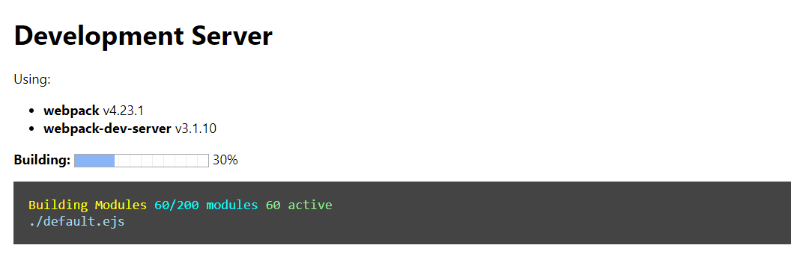

[](https://badge.fury.io/js/webpack-dev-server-waitpage)

# webpack-dev-server-waitpage
Webpack progress wait page for [webpack-dev-server](https://github.com/webpack/webpack-dev-server)

Instead of waiting for webpack to finish compiling, see a nice progress wait page.



## Installation

npm
```
npm install -D webpack-dev-server-waitpage
```

yarn
```
yarn add -D webpack-dev-server-waitpage
```

## Usage

#### webpack.config.js

1 - Add the plugin to the plugins array:
```js
const webpackDevServerWaitpage = require('webpack-dev-server-waitpage');

...
  plugins: [
     ...

     webpackDevServerWaitpage.plugin(),
  
     ...
  ] 

...
```

**Note:** Arguments for the `plugin` method are the same as the object that can be passed to `ProgressPlugin` besides the `handler` function which is used internally (it is best to leave it blank).

2 - Inside the `before`/`onBeforeSetupMiddleware` (depending on which version of webpack-dev-server you are using) option function of `devServer` enter the following line as in the example below:

webpack-dev-server@3
```js
const webpackDevServerWaitpage = require('webpack-dev-server-waitpage');

...

  devServer: {
    before: (app, server) => {

      // Be sure to pass the server argument from the arguments
      app.use(webpackDevServerWaitpage(server));

    }
  }
```
webpack-dev-server@4
```js
const webpackDevServerWaitpage = require('webpack-dev-server-waitpage');

...

  devServer: {
    onBeforeSetupMiddleware: server => {

      // Be sure to pass the server argument from the arguments
      server.app.use(webpackDevServerWaitpage(server, { theme: "material" }));

    }
  }

```
You can also provide options object for the middleware as a second parameter (i.e. `app.use(webpackDevServerWaitpage(options, {})`) or omit it.

#### Middleware options

| Option |Description|Type|Default Value|
|--------|-----------|----|-------------|
|`title`|The window title|`String`|`"Development Server"`|
|`theme`|Use a predefined theme (Options are: `"default"`, `"dark"`, `"material"`)|`String`|`"default"`|
|`template`|Provide an alternative `ejs` template (overrides the `theme` option)|`String`|The predefined template used by the `theme` option|
|`disableWhenValid`|Whether to stop showing the waitPage after the first compilation (otherwise, will continue to show on hot full page reloads)|`Boolean`|`true` 
|`ignore`|Rules to ignore certain url or requests. (String and RegExp are matched vs req.url, while Functions gets the express request as argument)|`string / RegExp / Function<Request>:Boolean / Array<string/RegExp/Function>`|`null`

* These and any other option would be passed to the global scope of the ejs template.


## Themes

There are other themes to choose from:

Dark


Material


### *** And you can also create your own! ***

### Developing a new template

You can clone this repository and use the script `test` to help you develop a new template.
- Create a new ejs file (e.g. `my-theme.ejs`)
- Change the `webpack.config.js` filename argument of `testMiddleware` to yours (e.g. `testMiddleware('my-theme.ejs')`).
- Run `npm t`

#### Template data object

The `ejs` renderer gets a data object with the following values:
```js
{
    title: "Development Server", // the window title
    webpackVersion: "4.0.0", // currently used webpack version
    webpackDevServerVersion: "1.0.0", // currently used webpack-dev-server version
    progress: [ // number of object as number of webpack configurations
      [
        0.5, // progress between 0 to 1
        "message", // message from webpack
        "0/1000", // modules progress message
        "0 active", // active modules message
        "<some path>" // path of current module
      ]
    ]
}
```

